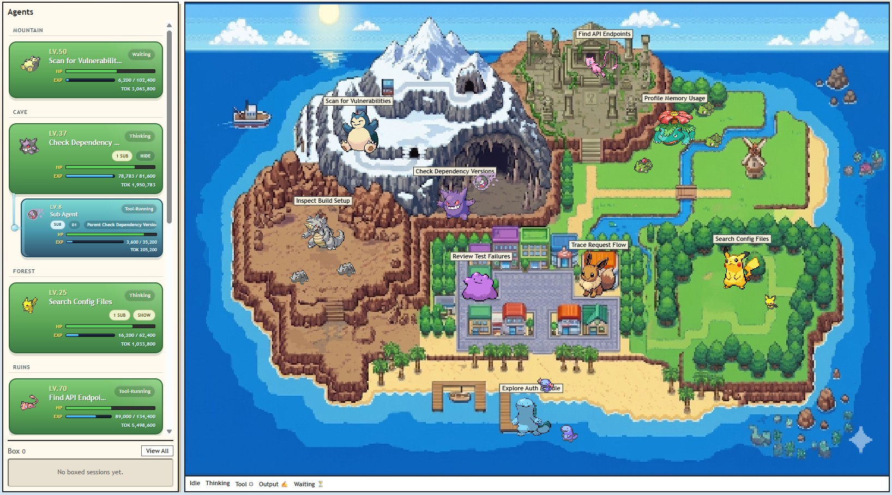
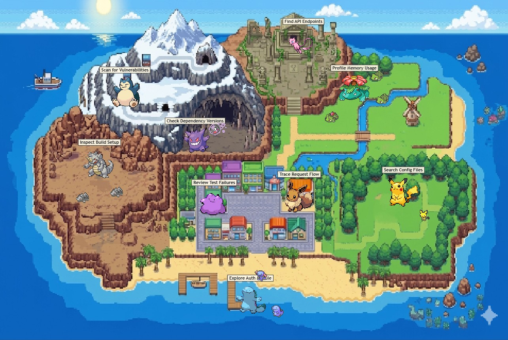
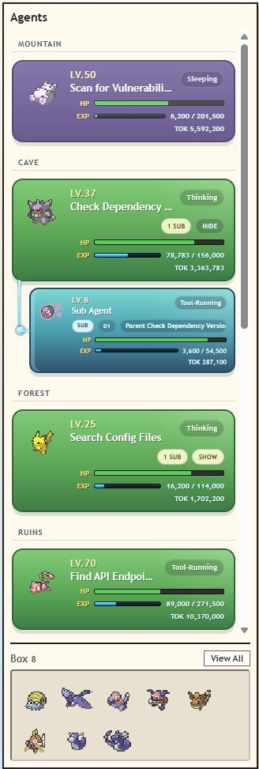
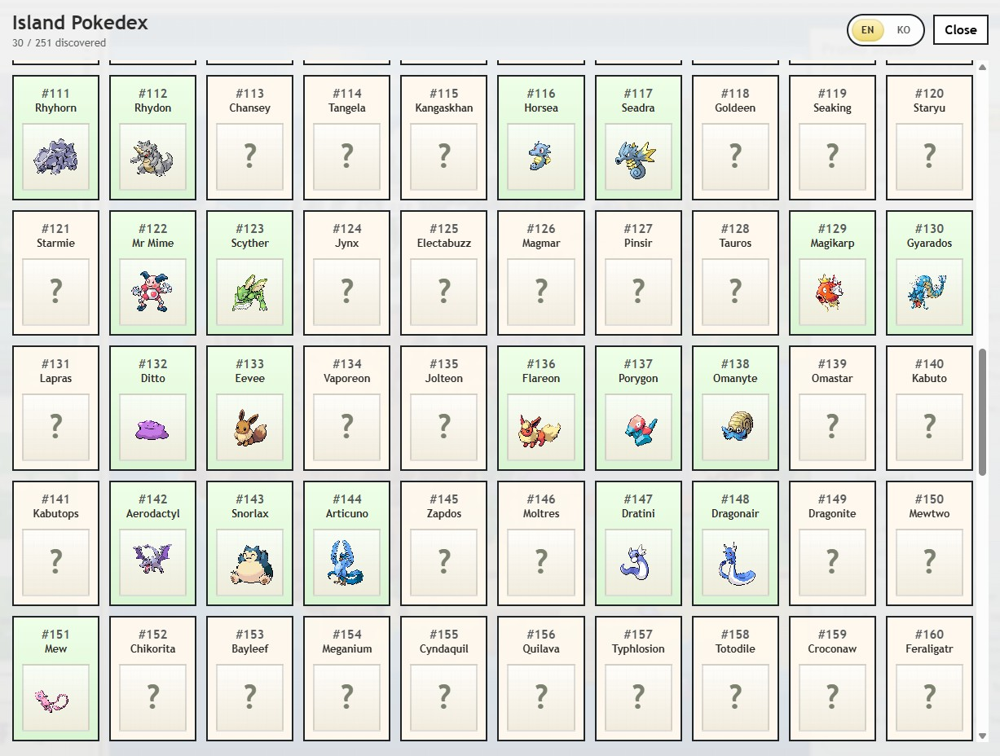

<p align="left"><strong>English</strong> | <a href="./README.ko.md">한국어</a></p>

# agentdex



> *Your Claude Code agents become Pokemon.*
>
> *Gotta Monitor 'Em All!*

`agentdex` is a live web dashboard for Claude Code agents.

Every active session gets assigned a Pokemon and dropped onto a tiny island map — so you can see at a glance what's running, what's waiting, and which sessions are burning through tokens the fastest.

## At A Glance

- `Active Pokemon` — the Claude Code agents currently running on your machine
- `HP` — remaining context window for that session
- `EXP` and `LV` — token usage surfaced as RPG-style progress
- `Status` — thinking, using a tool, outputting, waiting, or sleeping
- `Pokedex` — your running collection of every Pokemon you've ever spawned

## Table of Contents

- [Field Guide](#field-guide)
  - [Island](#island)
  - [Agents Panel](#agents-panel)
  - [Pokedex](#pokedex)
- [Installation](#installation)
- [Quick Start](#quick-start)
  - [Commands](#commands)
  - [Hard Reset](#hard-reset)
- [Mock Mode](#mock-mode)
- [Notes](#notes)

## Field Guide

### Island



- Every new session gets a Pokemon when it first appears in the world.
    - Pokemon spawn into habitat-matched parts of the island — cave Pokemon, grassland Pokemon, and sea Pokemon all show up where they belong.
    - Spawn odds are weighted by rarity, so commons appear much more often than rares.
- Root agents appear at full size; subagents show up nearby as smaller icons.
    - Subagents stay within the parent's evolutionary line, appearing as the same Pokemon or an earlier evolution.

### Agents Panel



- Every spawned Pokemon is mirrored in the left panel so you can see the active roster at a glance.
- `LV` and `EXP` grow with token spend.
- `HP` drops as the session burns through its context window — a useful signal for when to wrap up and start fresh.
- When a subagent is summoned, the panel shows its hierarchy under the parent.
- In live `watch` mode, a root agent that goes quiet for `10 minutes` switches to `Sleeping`.
- Stay quiet for `8 hours` total and it gets boxed off the live map.

- The Box archives finished sessions and keeps up to `300` records.

### Pokedex



- Every Pokemon you spawn is automatically registered.
- First discovery records when it was first seen, plus the project and session where it showed up.
- If a Pokemon was first discovered through a subagent, its parent lineage is recorded too.
- Gotta Catch 'Em All!

## Installation

On Ubuntu, install the prerequisites first:

```bash
sudo apt update
sudo apt install -y git nodejs npm
```

Then clone and download the Pokemon sprites:

```bash
git clone git@github.com:Hwiyeon/agentdex.git
cd agentdex
node tools/setup_poke_assets.js
```

- No external npm dependencies.
- Watches Claude Code transcripts under `~/.claude/projects` by default.
- `setup_poke_assets.js` pulls the sprite set from the [PokeAPI sprites repository](https://github.com/PokeAPI/sprites) into `public/vendor/pokeapi-sprites`.

## Quick Start
Inside the `agentdex` directory, start the live watcher: 

```bash
node cli.js watch
```

Open `http://127.0.0.1:8123`.

### Commands

```bash
node cli.js watch [--port 8123]
node cli.js mock [--port 8123] 
node cli.js hard-reset [watch|mock]
node cli.js help
```

### Hard Reset

Available in both `watch` and `mock` via the dashboard button.

- In `watch`: clears boxed history and Pokedex progress, keeps only currently active top-level agents on screen, and re-primes the watcher to the current end of each transcript so old history isn't replayed.
- In `mock`: clears the mock snapshot and Pokedex files, then reseeds a fresh scene.
- `node cli.js hard-reset [watch|mock]` does the same without starting the dashboard.

## Mock Mode

No real Claude logs? No problem. `mock` mode is for demos, screenshots, and UI testing.

```bash
node cli.js mock
```

Open `Promo Studio` from the top bar while in `mock` mode to build polished promo scenes — spawn any Pokemon you want, tune `Level`, `HP %`, `EXP`, and `Status`, box and unbox custom root agents, and export the current scene as a PNG.

All mock data is local-only and never touches your real transcript files.

## Notes

- Tested on Ubuntu and macOS. Should work on other Node.js platforms, but not guaranteed.
- Current Pokedex covers the first `251` Pokemon. More updates are planned.
